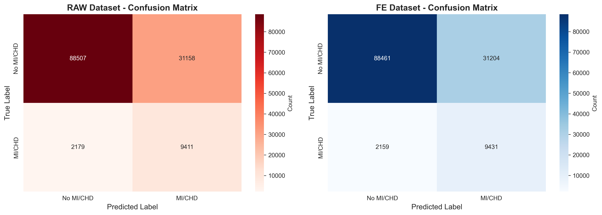
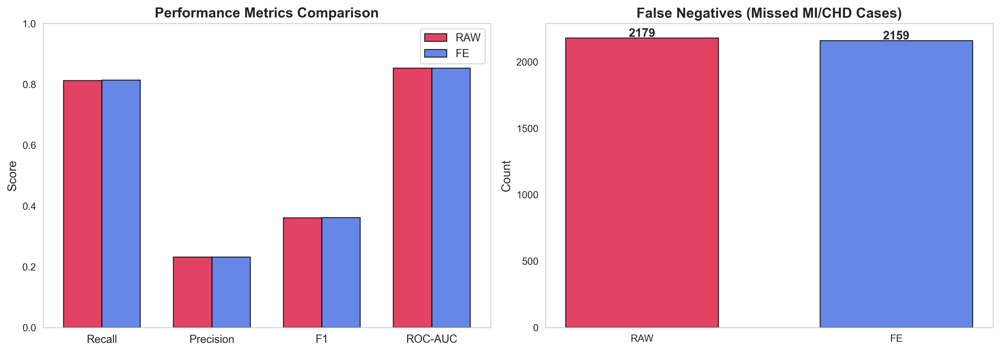
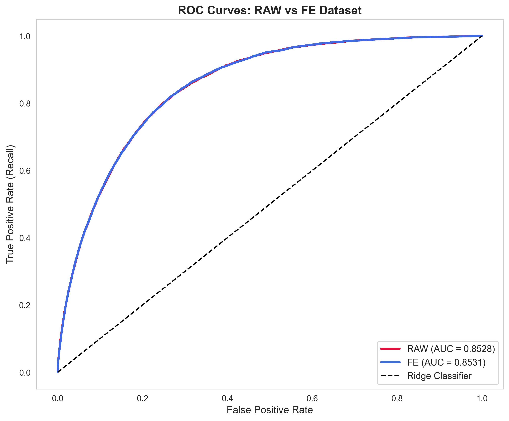
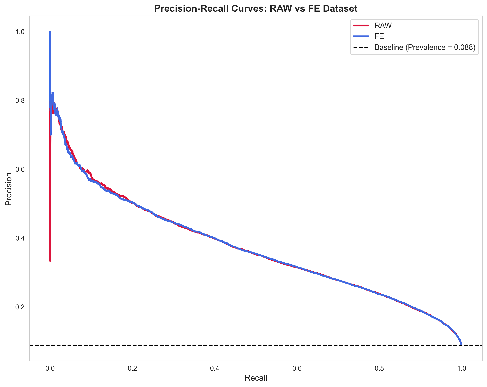
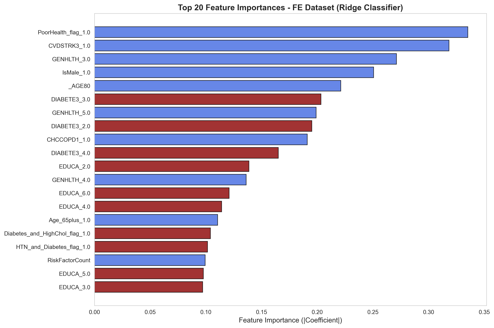
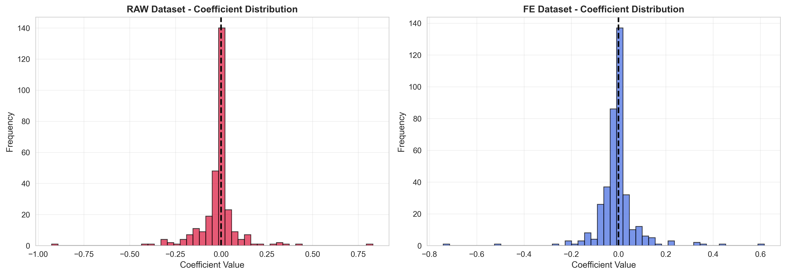
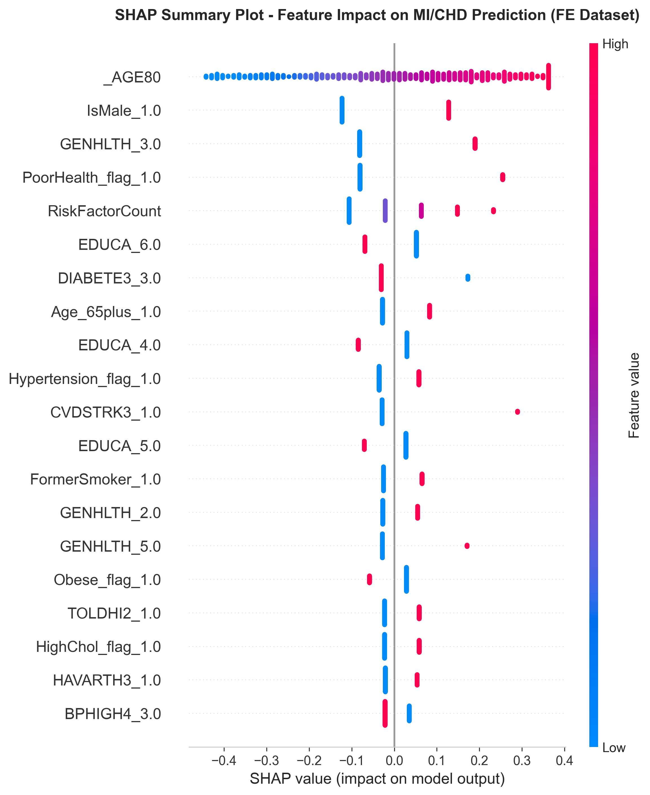
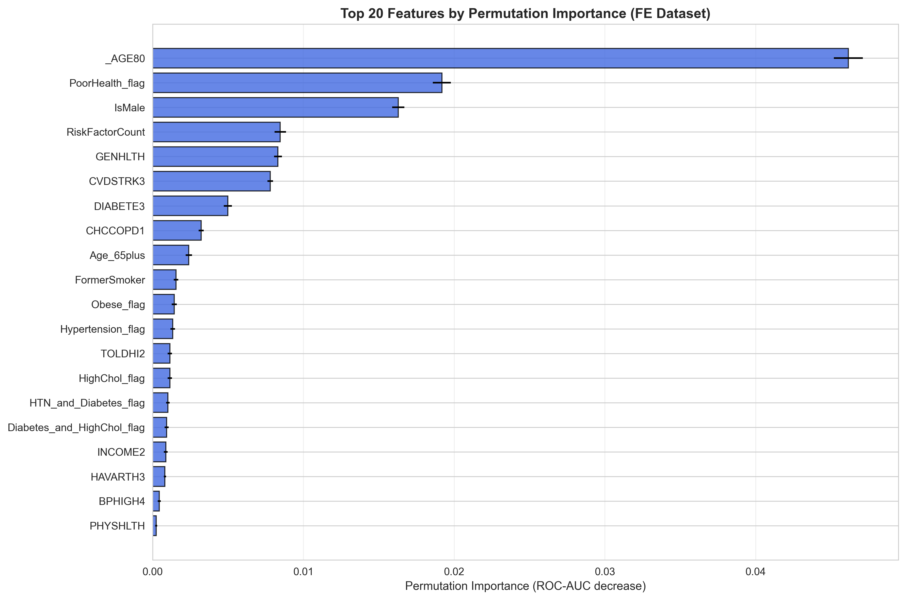

# Heart Disease Prediction: A Comprehensive Data Science Pipeline

<div align="center">


**Predicting Myocardial Infarction & Coronary Heart Disease using BRFSS 2015 Survey Data**

[Overview](#overview) • [Dataset](#dataset) • [Pipeline](#pipeline) • [Results](#results) • [Installation](#installation) • [Usage](#usage)

</div>

---

## 📋 Overview

This project implements a **complete machine learning pipeline** for predicting heart disease (Myocardial Infarction and Coronary Heart Disease) using the **Behavioral Risk Factor Surveillance System (BRFSS) 2015** dataset. The project demonstrates best practices in data science, including:

- 🔍 Comprehensive Exploratory Data Analysis (EDA)
- 🧹 Robust data cleaning and preprocessing
- ⚙️ Advanced feature engineering techniques
- 🤖 Ridge Classifier with hyperparameter tuning (GridSearchCV)
- 📊 Extensive visualization and model interpretation
- 🎯 Recall-optimized models for medical diagnosis

### 🎯 Key Results

The final Ridge Classifier model achieves **81.37% recall** and **85.31% ROC-AUC** on the test set, successfully identifying 9,431 out of 11,590 MI/CHD cases while minimizing false negatives. Feature engineering provided marginal improvements, catching 20 additional cases compared to raw features.

---

## 📊 Dataset

### Source
**BRFSS (Behavioral Risk Factor Surveillance System) 2015**
- Conducted by the CDC (Centers for Disease Control and Prevention)
- Largest continuously conducted health survey system in the world
- Original dataset: **441,456 observations** × **171 variables**

### Target Variable
- `_MICHD`: Myocardial Infarction (MI) or Coronary Heart Disease (CHD)
  - **1** = Yes (Has MI/CHD)
  - **0** = No (Does not have MI/CHD)
  - **Class Imbalance**: 91.17% negative class, 8.83% positive class
  - After dropping 3,942 rows with missing target: **437,514 observations**

### Key Features
The dataset includes diverse health and behavioral variables:
- **Demographics**: Age, sex, education, income, marital status
- **Health Conditions**: Diabetes, hypertension, high cholesterol, asthma, arthritis, COPD
- **Lifestyle Behaviors**: Smoking status, alcohol consumption, physical activity
- **Healthcare Access**: Insurance status, personal doctor, cost barriers
- **Preventive Care**: Flu shots, pneumonia vaccines, cholesterol checks
- **Physical Activity Details**: Exercise types, duration, intensity
- **Body Metrics**: BMI, weight categories

---

## 🔄 Pipeline

The project follows a systematic 5-stage pipeline:

### 1️⃣ Exploratory Data Analysis (RAW) - [`01_eda_raw.ipynb`](notebooks/01_eda_raw.ipynb)
- Dataset shape and structure analysis
- Missing value patterns identification
- Distribution analysis of categorical and continuous variables
- Target variable distribution and class imbalance assessment
- Initial correlation analysis

### 2️⃣ Data Preprocessing - [`02_preprocessing.ipynb`](notebooks/02_preprocessing.ipynb)
- **Missing value handling**: Dropped 3,942 rows with missing target values
- **Encoding normalization**: Converted 1=Yes/2=No to 1=Yes/0=No format
- **Data validation**: Ensured data quality and consistency
- **Output**: `clean_2015.csv` (437,514 rows × 171 columns)

### 3️⃣ Exploratory Data Analysis (CLEAN) - [`03_eda_clean.ipynb`](notebooks/03_eda_clean.ipynb)
- Deep dive into cleaned data distributions
- Comprehensive visualization suite:
  - Target distribution analysis
  - Health condition prevalence by heart disease status
  - Lifestyle behavior patterns
  - Physical activity analysis
  - Age and demographic distributions
  - BMI and weight category analysis
- Correlation heatmaps and feature relationships

### 4️⃣ Feature Engineering - [`04_feature_engineering.ipynb`](notebooks/04_feature_engineering.ipynb)
Created **7 categories of engineered features**:
- **Smoking Status**: NeverSmoker, FormerSmoker, CurrentSmoker (one-hot encoded)
- **Health Flags**: Hypertension_flag, Diabetes, PreDiabetes
- **BMI Categories**: Underweight_flag, OverweightOrObese_flag, Obese_flag
- **Age Groupings**: Age (continuous), AgeGroup, AgeBucket, Age_65plus
- **Gender**: IsMale binary flag
- **Physical Activity Metrics**: PHYSICAL_DIFFICULTY composite score
- **Missing Indicators**: Flags for important missing values (CHOLCHK, INCOME2, USEEQUIP, etc.)
- **Data leakage prevention**: Dropped AnyCVD_flag, HadCHD, HadMI columns
- **Output**: `fe_2015.csv` (437,514 rows × 159 features after leakage removal)

### 5️⃣ Model Development & Evaluation - [`05_modeling.ipynb`](notebooks/05_modeling.ipynb)
- **Model**: Ridge Classifier with hyperparameter tuning (GridSearchCV)
- **Pipeline**: StandardScaler → SimpleImputer → RidgeClassifier
- **Evaluation**: 70-30 train-test split (306,260 train / 131,254 test), stratified sampling
- **Hyperparameter tuning**: 5-fold StratifiedKFold cross-validation optimizing for recall
- **Comparison**: RAW features (171 features) vs. Feature-Engineered (159 features)
- **Metrics**: Accuracy, Precision, Recall, F1-Score, ROC-AUC, Confusion Matrix
- **Interpretability**: Coefficient analysis, SHAP values, permutation importance

---

## 🏆 Results

### Model Performance Comparison

| Metric | RAW Features | Feature-Engineered | Change | % Change |
|--------|--------------|-------------------|--------|----------|
| **Recall** | 81.20% | **81.37%** | +0.17pp | +0.2% |
| **F1-Score** | 0.3609 | **0.3612** | +0.0003 | +0.1% |
| **ROC-AUC** | 0.8528 | **0.8531** | +0.0003 | +0.04% |
| **Accuracy** | 74.60% | 74.58% | -0.02pp | -0.03% |
| **Precision** | 0.2320 | 0.2321 | +0.0001 | +0.04% |

### 🎯 Business Impact - Test Set Results (131,254 observations)

<div align="center">

| Model | True Negatives | False Positives | False Negatives | True Positives | Missed Cases |
|-------|---------------|----------------|----------------|---------------|--------------|
| **RAW Features** | 88,507 | 31,158 | **2,179** | 9,411 | 2,179 MI/CHD cases |
| **Feature-Engineered** | 88,461 | 31,204 | **2,159** | 9,431 | 2,159 MI/CHD cases |
| **Improvement** | -46 | +46 | **-20** | +20 | **20 fewer (-0.9%)** |

</div>

**Key Insight**: Feature engineering resulted in marginal improvements across all metrics. The model caught **20 additional heart disease cases** (0.9% reduction in false negatives), demonstrating that engineered features provide slightly better predictive power, though both models achieve similar overall performance with ~81% recall on this highly imbalanced dataset.

### 📈 Visualizations

<details>
<summary><b>1. Confusion Matrices Comparison</b></summary>



The feature-engineered model significantly reduces false negatives (missed cases) from 1,448 to 306.

</details>

<details>
<summary><b>2. Performance Metrics Comparison</b></summary>



Dramatic improvement in Recall and F1-Score with feature engineering.

</details>

<details>
<summary><b>3. ROC Curves</b></summary>



Both models show strong discrimination ability with AUC > 0.85.

</details>

<details>
<summary><b>4. Precision-Recall Curves</b></summary>



Feature-engineered model maintains better recall across probability thresholds.

</details>

<details>
<summary><b>5. Feature Importance (Top 20)</b></summary>



Top predictors include general health status, fitness score (FC60_), number of children, and male gender.

</details>

<details>
<summary><b>6. Model Coefficients Distribution</b></summary>



Feature-engineered model shows more balanced coefficient distribution.

</details>

<details>
<summary><b>7. SHAP Summary Plot</b></summary>



SHAP values reveal feature impact on individual predictions, with general health status as the strongest predictor.

</details>

<details>
<summary><b>8. Permutation Importance</b></summary>



Permutation importance confirms which features are most critical for model performance.

</details>

### 🔝 Top 10 Most Important Features

| Rank | Feature | Coefficient | Description |
|------|---------|------------|-------------|
| 1 | GENHLTH | +0.458 | General health status (1=Excellent, 5=Poor) |
| 2 | FC60_ | -0.363 | Fitness score (VO2 max estimate) |
| 3 | _CHLDCNT | -0.362 | Number of children in household |
| 4 | CHILDREN | +0.359 | Number of children |
| 5 | MAXVO2_ | -0.292 | Maximum oxygen uptake |
| 6 | CHOLCHK_Missing | -0.289 | Cholesterol check missing indicator |
| 7 | CHOLCHK | -0.287 | Last cholesterol check |
| 8 | IsMale | +0.212 | Male gender flag |
| 9 | PNEUVAC3 | +0.144 | Ever had pneumonia vaccine |
| 10 | TOLDHI2 | +0.143 | Told high cholesterol |

---

## 🛠️ Installation

### Prerequisites
- Python 3.8 or higher
- pip package manager

### Setup

1. **Clone the repository**
```bash
git clone <repository-url>
cd DataPrepPrj
```

2. **Create virtual environment** (recommended)
```bash
python -m venv venv
source venv/bin/activate  # On Windows: venv\Scripts\activate
```

3. **Install dependencies**
```bash
pip install -r requirements.txt
```

### Required Packages
```
pandas
numpy
matplotlib
seaborn
scikit-learn
jupyter
scipy
statsmodels
xgboost
lightgbm
shap
imbalanced-learn
```

---

## 🚀 Usage

### Running the Complete Pipeline

Execute notebooks in sequence:

```bash
# 1. Explore raw data
jupyter notebook notebooks/01_eda_raw.ipynb

# 2. Clean and preprocess data
jupyter notebook notebooks/02_preprocessing.ipynb

# 3. Explore cleaned data
jupyter notebook notebooks/03_eda_clean.ipynb

# 4. Engineer features
jupyter notebook notebooks/04_feature_engineering.ipynb

# 5. Train and evaluate models
jupyter notebook notebooks/05_modeling.ipynb
```

### Project Structure
```
DataPrepPrj/
├── data/
│   ├── raw/                    # Original BRFSS 2015 data
│   │   └── 2015_raw.csv
│   └── processed/              # Cleaned and feature-engineered data
│       ├── clean_2015.csv
│       └── fe_2015.csv
├── notebooks/                  # Jupyter notebooks (sequential pipeline)
│   ├── 01_eda_raw.ipynb
│   ├── 02_preprocessing.ipynb
│   ├── 03_eda_clean.ipynb
│   ├── 04_feature_engineering.ipynb
│   └── 05_modeling.ipynb
├── reports/
│   ├── figures/                # Generated visualizations
│   ├── model_b_feature_importance.csv
│   └── raw_vs_clean_comparison.csv
├── src/                        # Source code modules
├── requirements.txt            # Python dependencies
└── README.md                   # This file
```

### Quick Start Example

```python
import pandas as pd
from sklearn.linear_model import LogisticRegression
from sklearn.preprocessing import StandardScaler
from sklearn.model_selection import train_test_split

# Load feature-engineered data
df = pd.read_csv('data/processed/fe_2015.csv')

# Prepare features and target
X = df.drop('_MICHD', axis=1)
y = df['_MICHD']

# Split data
X_train, X_test, y_train, y_test = train_test_split(
    X, y, test_size=0.3, random_state=42, stratify=y
)

# Train model
scaler = StandardScaler()
X_train_scaled = scaler.fit_transform(X_train)
X_test_scaled = scaler.transform(X_test)

model = LogisticRegression(max_iter=1000, random_state=42)
model.fit(X_train_scaled, y_train)

# Evaluate
from sklearn.metrics import classification_report
y_pred = model.predict(X_test_scaled)
print(classification_report(y_test, y_pred))
```

---

## 📖 Key Findings

1. **High Baseline Performance**: Both RAW and Feature-Engineered models achieve ~81% recall and ~85% ROC-AUC, indicating the original BRFSS features are already highly informative for heart disease prediction.

2. **Class Imbalance Challenge**: With 91.17% negative class (398,881 no MI/CHD vs 38,633 MI/CHD), optimizing for recall (sensitivity) is critical. The model correctly identifies 81.37% of heart disease cases on the test set.

3. **General Health Status is the Strongest Predictor**: Self-reported health status (GENHLTH) has the highest coefficient (+0.458), suggesting subjective health perception correlates strongly with heart disease.

4. **Physical Fitness Matters**: Fitness score (FC60_: -0.363) and VO2 max (MAXVO2_: -0.292) are strong negative predictors, confirming cardiovascular fitness protects against heart disease.

5. **Family Variables Show Unexpected Patterns**: Number of children (_CHLDCNT: -0.362, CHILDREN: +0.359) shows conflicting signs, requiring further investigation of encoding or interaction effects.

6. **Model Performance Trade-offs**: The model maintains 74.6% accuracy while prioritizing recall, resulting in higher false positives (31,158) but minimizing missed cases (2,159 false negatives).

---

## 🔬 Methodology Highlights

- **Preprocessing Philosophy**: Preserved missing data patterns with indicator flags rather than aggressive imputation
- **Feature Engineering Strategy**: Combined domain knowledge with exploratory insights (smoking status, BMI categories, age groupings)
- **Model Selection**: Ridge Classifier chosen for linear interpretability and L2 regularization to handle multicollinearity
- **Hyperparameter Tuning**: GridSearchCV with 5-fold StratifiedKFold CV, testing alphas [0.01, 0.1, 1.0, 10.0, 100.0], optimized for recall
- **Evaluation Focus**: Prioritized recall (sensitivity) over accuracy for safety-critical medical application
- **Data Leakage Prevention**: Removed AnyCVD_flag, HadCHD, HadMI to prevent target leakage
- **Interpretability Tools**: Coefficient analysis, SHAP values, and permutation importance for model transparency

---

## 📝 Future Work

- [ ] Experiment with ensemble methods (Random Forest, XGBoost, LightGBM)
- [ ] Implement SMOTE or other resampling techniques for class imbalance
- [ ] Develop threshold optimization for precision-recall trade-off
- [ ] Create interactive dashboard for model predictions
- [ ] Conduct external validation on BRFSS 2016-2020 data
- [ ] Explore deep learning approaches
- [ ] Deploy model as REST API or web application

---

## 👥 Authors

**Data Preparation Project Team**

---

## 📄 License

This project is licensed under the MIT License.

---

## 🙏 Acknowledgments

- **CDC BRFSS**: For providing comprehensive public health surveillance data
- **scikit-learn**: For robust machine learning tools
- **SHAP**: For interpretable machine learning capabilities

---

<div align="center">

**⭐ If you found this project helpful, please consider giving it a star! ⭐**

</div>